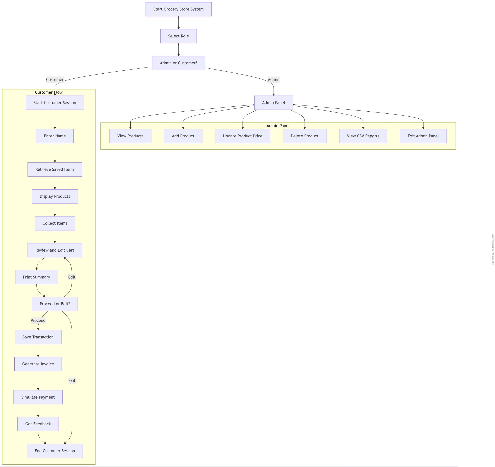

# Grocery Store Management System

This is a command-line Python application that simulates a grocery store system. It includes two versions: a basic implementation using procedural logic in a Jupyter Notebook, and an advanced, modular version using object-oriented programming and persistent data storage.

---

## Project Versions

- **Basic Version**: Implemented using Jupyter Notebook (`basic_version/g_app.ipynb`). Suitable for quick demonstration and learning procedural flow.
- **Advanced Version**: Implemented in Python (`advanced_version/app.py`) with modular code, class-based structure, admin/customer roles, and CSV-based persistence.

---

## Features

### Customer

- Browse available products
- Add products to cart
- Save items for later
- Edit and review cart
- Simulated payment with invoice generation
- Submit feedback

### Admin

- View all products
- Add new products
- Update existing product prices
- Delete products
- View formatted CSV reports (transactions, feedback, saved items)

---

## Technologies Used

- Python 3
- Jupyter Notebook (for basic version)
- Python script (for advanced version)
- CSV (data persistence)
- `os`, `datetime`, `uuid` (file handling and tracking)
- `colorama`, `tabulate`, `tqdm` (CLI enhancements)
- Object-Oriented Programming
- Modular Programming

---

## Learning Outcomes

| Topic                          | Learning Applied                                            |
|-------------------------------|-------------------------------------------------------------|
| **Procedural vs OOP**          | Learned transitioning from basic to structured OOP code     |
| **File Handling**              | Read/write CSVs, append vs overwrite operations             |
| **Input Validation**           | Ensured robust handling of user inputs                      |
| **Separation of Concerns**     | Split logic: admin vs customer, file vs memory operations   |
| **CLI UI/UX Design**           | Enhanced using colorama, tabulate, and tqdm (progress bars) |
| **Data Persistence**           | Transactions, feedback, saved carts retained in files       |

---

## Project Structure

```

grocery-store-system/
│
├── basic_version/
│ └── g_app.ipynb
│
├── advanced_version/
│ ├── app.py
│ └── grocery_app.py
│
├── data/
│ ├── items.csv
│ ├── transactions.csv
│ ├── feedback.csv
│ └── save_for_later.csv
│
├── flowchart.png
│
└── README.md

```

---

## System Workflow (Advanced Version)

- Start the system
- Choose role: Admin or Customer

**If Admin:**

1. View Products  
2. Add Product  
3. Update Product Price  
4. Delete Product  
5. View CSV Reports  
6. Exit

**If Customer:**

1. Enter name  
2. Retrieve saved items  
3. View product catalog  
4. Add items to cart or save for later  
5. Review and edit cart  
6. Proceed with checkout or modify cart  
7. Save transaction and simulate payment  
8. Generate invoice  
9. Provide feedback  
10. End session

> Below is the flowchart representation of how the advanced grocery system functions:



---

## How to Run

### Basic Version (Jupyter Notebook)

1. Open `g_app.ipynb` in Jupyter Notebook
2. Run all cells sequentially
3. Input as prompted to interact with the app.

### Advanced Version (Python Scripts)

1. Ensure Python is installed
2. Install dependencies:
   ```bash
   pip install colorama tabulate tqdm
   ```
3. Run the program:
   ```bash
   python app.py
   ```
4. Choose role:
   - **Admin**: Manage products & view reports.
   - **Customer**: Start shopping experience.

---

## Usage Examples

### Customer
```text
> Enter your name: alice
> item_id,qty          → 3,2
> item_id,qty,save     → 4,1,save
> done
> proceed
```

### Admin
```text
1. View Products
2. Add Product (e.g., Milk, 45)
3. Update Price (e.g., change Rice to ₹60)
4. Delete Product
5. View CSV Reports (tabulated view of transactions, feedback, saved carts)
```

---

## Possible Future Enhancements

- Add **login system** with roles and authentication.
- Use **SQLite** or **JSON** for more robust data persistence.
- Add **unit testing** for core logic.
- Build **GUI or web interface** for better usability.

---

## Final Notes

This project was developed as a **hands-on revision** of Python fundamentals, covering:

- Basics of input/output
- File operations and persistence
- Functional and class-based programming
- CLI-based interface enhancement
- Simulated real-world use case (grocery shopping)

It not only reinforced syntax but also emphasized **clean code**, **modularity**, and **scalable architecture**.

---

**Author**: Ritvik Burri  
